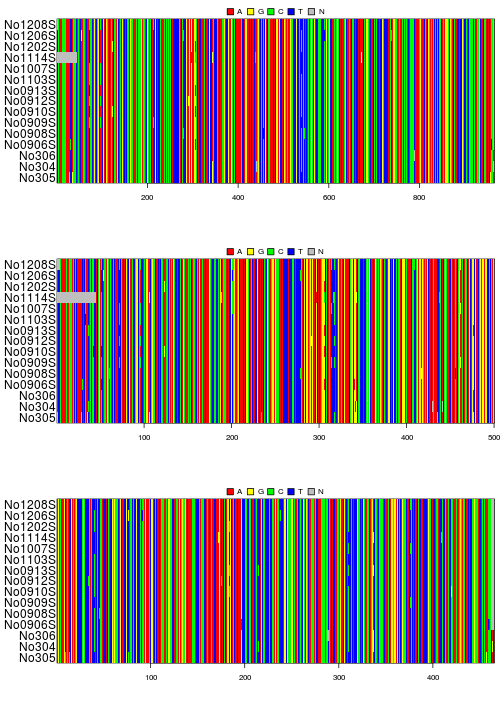
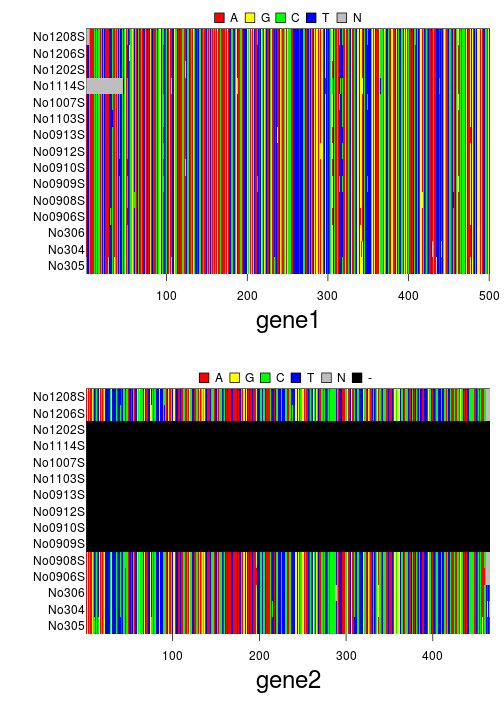
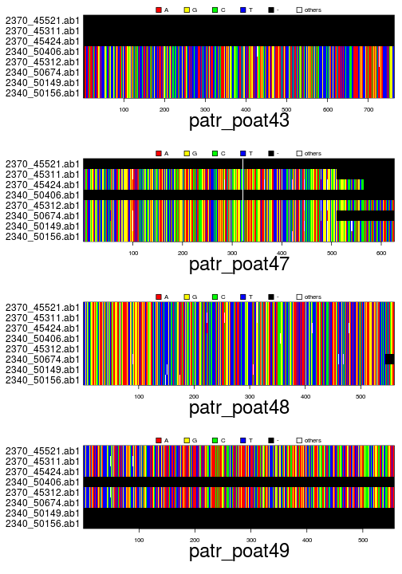
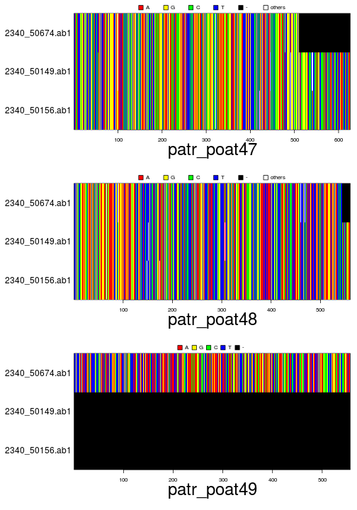
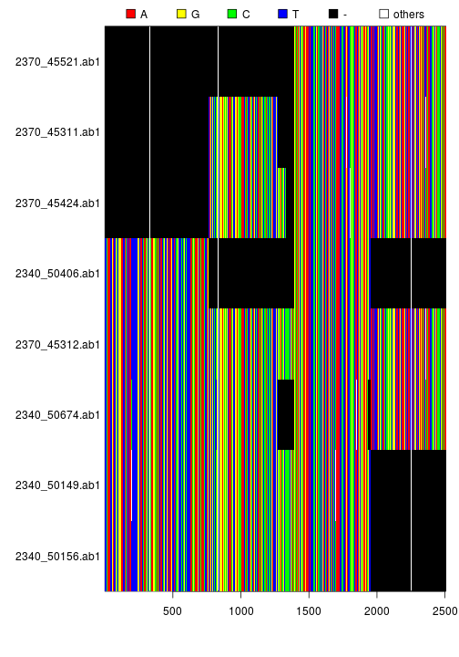

[](https://travis-ci.org/thibautjombart/apex)


#apex
Extension of the R package ape for multiple genes.

Installing *apex*
-------------
To install the development version from github: 

```r
library(devtools)
install_github("thibautjombart/apex")
```

Functionalities
----------------

#### Classes of object

See the classes:
* **multidna:** formal (S4) class, storing data using a list of DNAbin objects.
* 
Example code:

```r
library("apex")
## empty object
new("multidna")
```

```
## === multidna ===
## [ 0 DNA sequence in 0 gene ]
## 
## @n.ind: 0 individual
## @n.seq: 0 sequence in total
## @labels:
```

```r
## simple conversion with nicely ordered output
data(woodmouse)
genes <- list(gene1=woodmouse[,1:500], gene2=woodmouse[,501:965])
x <- new("multidna", genes)
x
```

```
## === multidna ===
## [ 30 DNA sequences in 2 genes ]
## 
## @n.ind: 15 individuals
## @n.seq: 30 sequences in total
## @labels: No305 No304 No306 No0906S No0908S No0909S...
## 
## @dna:
## $gene1
## 15 DNA sequences in binary format stored in a matrix.
## 
## All sequences of same length: 500 
## 
## Labels: No305 No304 No306 No0906S No0908S No0909S ...
## 
## Base composition:
##     a     c     g     t 
## 0.326 0.230 0.147 0.297 
## 
## $gene2
## 15 DNA sequences in binary format stored in a matrix.
## 
## All sequences of same length: 465 
## 
## Labels: No305 No304 No306 No0906S No0908S No0909S ...
## 
## Base composition:
##     a     c     g     t 
## 0.286 0.295 0.103 0.316
```

```r
par(mfrow=c(3,1))
image(woodmouse)
image(x@dna[[1]])
image(x@dna[[2]])
```

 

```r
## trickier conversion with missing sequences / wrong order
genes <- list(gene1=woodmouse[,1:500], gene2=woodmouse[c(5:1,14:15),501:965])
x <- new("multidna", genes)
x
```

```
## === multidna ===
## [ 22 DNA sequences in 2 genes ]
## 
## @n.ind: 15 individuals
## @n.seq: 22 sequences in total
## @labels: No305 No304 No306 No0906S No0908S No0909S...
## 
## @dna:
## $gene1
## 15 DNA sequences in binary format stored in a matrix.
## 
## All sequences of same length: 500 
## 
## Labels: No305 No304 No306 No0906S No0908S No0909S ...
## 
## Base composition:
##     a     c     g     t 
## 0.326 0.230 0.147 0.297 
## 
## $gene2
## 15 DNA sequences in binary format stored in a matrix.
## 
## All sequences of same length: 465 
## 
## Labels: No305 No304 No306 No0906S No0908S No0909S ...
## 
## Base composition:
##     a     c     g     t 
## 0.286 0.294 0.103 0.316
```

```r
plot(x)
```

 

#### Reading data from multiple files
See the functions:
* **read.multidna:** reads multiple DNA alignments with various formats
* **read.multiFASTA:** same for FASTA files

Example code:

```r
files <- dir(system.file(package="apex"),patter="patr", full=TRUE)
 
## read files
x <- read.multiFASTA(files)
x
```

```
## === multidna ===
## [ 24 DNA sequences in 4 genes ]
## 
## @n.ind: 8 individuals
## @n.seq: 24 sequences in total
## @labels: 2340_50156.ab1  2340_50149.ab1  2340_50674.ab1  2370_45312.ab1  2340_50406.ab1  2370_45424.ab1 ...
## 
## @dna:
## $patr_poat43
## 8 DNA sequences in binary format stored in a matrix.
## 
## All sequences of same length: 764 
## 
## Labels: 2340_50156.ab1  2340_50149.ab1  2340_50674.ab1  2370_45312.ab1  2340_50406.ab1  2370_45424.ab1  ...
## 
## Base composition:
##     a     c     g     t 
## 0.320 0.158 0.166 0.356 
## 
## $patr_poat47
## 8 DNA sequences in binary format stored in a matrix.
## 
## All sequences of same length: 626 
## 
## Labels: 2340_50156.ab1  2340_50149.ab1  2340_50674.ab1  2370_45312.ab1  2340_50406.ab1  2370_45424.ab1  ...
## 
## Base composition:
##     a     c     g     t 
## 0.227 0.252 0.256 0.266 
## 
## $patr_poat48
## 8 DNA sequences in binary format stored in a matrix.
## 
## All sequences of same length: 560 
## 
## Labels: 2340_50156.ab1  2340_50149.ab1  2340_50674.ab1  2370_45312.ab1  2340_50406.ab1  2370_45424.ab1  ...
## 
## Base composition:
##     a     c     g     t 
## 0.305 0.185 0.182 0.327 
## 
## $patr_poat49
## 8 DNA sequences in binary format stored in a matrix.
## 
## All sequences of same length: 556 
## 
## Labels: 2340_50156.ab1  2340_50149.ab1  2340_50674.ab1  2370_45312.ab1  2340_50406.ab1  2370_45424.ab1  ...
## 
## Base composition:
##     a     c     g     t 
## 0.344 0.149 0.187 0.320
```

```r
plot(x)
```

 


#### Data handling
See the functions:
* **concatenate:** concatenate seeral genes into a single DNAbin matrix 
* **x[i,j]:** subset x by individuals (i) and/or genes (j)

Example code:

```r
files <- dir(system.file(package="apex"),patter="patr", full=TRUE)
files
```

```
## [1] "/home/thibaut/R/x86_64-unknown-linux-gnu-library/3.3/apex/patr_poat43.fasta"
## [2] "/home/thibaut/R/x86_64-unknown-linux-gnu-library/3.3/apex/patr_poat47.fasta"
## [3] "/home/thibaut/R/x86_64-unknown-linux-gnu-library/3.3/apex/patr_poat48.fasta"
## [4] "/home/thibaut/R/x86_64-unknown-linux-gnu-library/3.3/apex/patr_poat49.fasta"
```

```r
## read files
x <- read.multiFASTA(files)
x
```

```
## === multidna ===
## [ 24 DNA sequences in 4 genes ]
## 
## @n.ind: 8 individuals
## @n.seq: 24 sequences in total
## @labels: 2340_50156.ab1  2340_50149.ab1  2340_50674.ab1  2370_45312.ab1  2340_50406.ab1  2370_45424.ab1 ...
## 
## @dna:
## $patr_poat43
## 8 DNA sequences in binary format stored in a matrix.
## 
## All sequences of same length: 764 
## 
## Labels: 2340_50156.ab1  2340_50149.ab1  2340_50674.ab1  2370_45312.ab1  2340_50406.ab1  2370_45424.ab1  ...
## 
## Base composition:
##     a     c     g     t 
## 0.320 0.158 0.166 0.356 
## 
## $patr_poat47
## 8 DNA sequences in binary format stored in a matrix.
## 
## All sequences of same length: 626 
## 
## Labels: 2340_50156.ab1  2340_50149.ab1  2340_50674.ab1  2370_45312.ab1  2340_50406.ab1  2370_45424.ab1  ...
## 
## Base composition:
##     a     c     g     t 
## 0.227 0.252 0.256 0.266 
## 
## $patr_poat48
## 8 DNA sequences in binary format stored in a matrix.
## 
## All sequences of same length: 560 
## 
## Labels: 2340_50156.ab1  2340_50149.ab1  2340_50674.ab1  2370_45312.ab1  2340_50406.ab1  2370_45424.ab1  ...
## 
## Base composition:
##     a     c     g     t 
## 0.305 0.185 0.182 0.327 
## 
## $patr_poat49
## 8 DNA sequences in binary format stored in a matrix.
## 
## All sequences of same length: 556 
## 
## Labels: 2340_50156.ab1  2340_50149.ab1  2340_50674.ab1  2370_45312.ab1  2340_50406.ab1  2370_45424.ab1  ...
## 
## Base composition:
##     a     c     g     t 
## 0.344 0.149 0.187 0.320
```

```r
plot(x)
```

 

```r
## subset
plot(x[1:3,2:4])
```

 

```r
## concatenate
y <- concatenate(x)
y
```

```
## 8 DNA sequences in binary format stored in a matrix.
## 
## All sequences of same length: 2506 
## 
## Labels: 2340_50156.ab1  2340_50149.ab1  2340_50674.ab1  2370_45312.ab1  2340_50406.ab1  2370_45424.ab1  ...
## 
## Base composition:
##     a     c     g     t 
## 0.298 0.187 0.197 0.319
```

```r
image(y)
```

 


#### Exporting data
Check functions:
* **multidna2genind:** concatenate genes and export to genind

Example:

```r
## read data in
files <- dir(system.file(package="apex"),patter="patr", full=TRUE)
files
```

```
## [1] "/home/thibaut/R/x86_64-unknown-linux-gnu-library/3.3/apex/patr_poat43.fasta"
## [2] "/home/thibaut/R/x86_64-unknown-linux-gnu-library/3.3/apex/patr_poat47.fasta"
## [3] "/home/thibaut/R/x86_64-unknown-linux-gnu-library/3.3/apex/patr_poat48.fasta"
## [4] "/home/thibaut/R/x86_64-unknown-linux-gnu-library/3.3/apex/patr_poat49.fasta"
```

```r
## read files
x <- read.multiFASTA(files)

## export to genind
obj <- multidna2genind(x)
obj
```

```
## 
##    #####################
##    ### Genind object ### 
##    #####################
## - genotypes of individuals - 
## 
## S4 class:  genind
## @call: DNAbin2genind(x = concatenate(x, genes = genes))
## 
## @tab:  8 x 22 matrix of genotypes
## 
## @ind.names: vector of  8 individual names
## @loc.names: vector of  11 locus names
## @loc.nall: number of alleles per locus
## @loc.fac: locus factor for the  22 columns of @tab
## @all.names: list of  11 components yielding allele names for each locus
## @ploidy:  1 1 1 1 1 1
## @type:  codom
## 
## Optional contents: 
## @pop:  - empty -
## @pop.names:  - empty -
## 
## @other: - empty -
```
